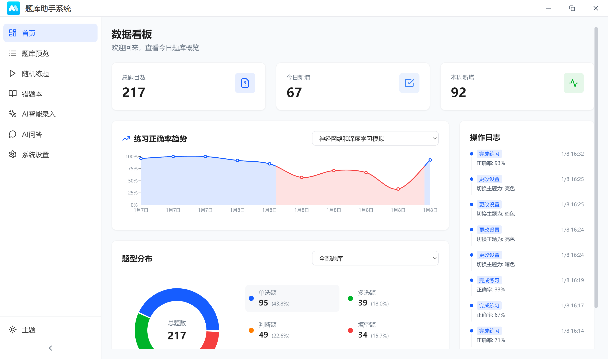
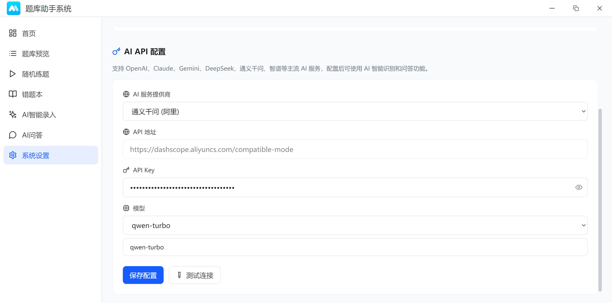
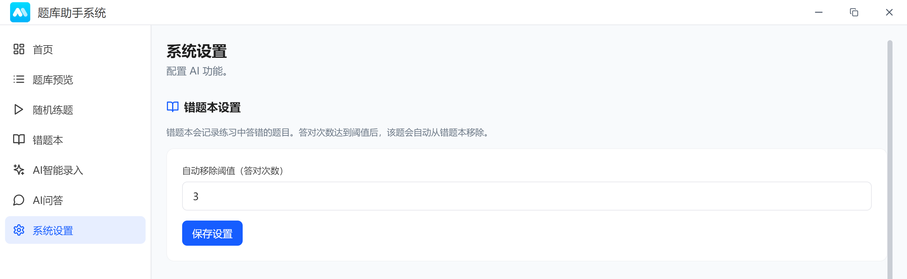
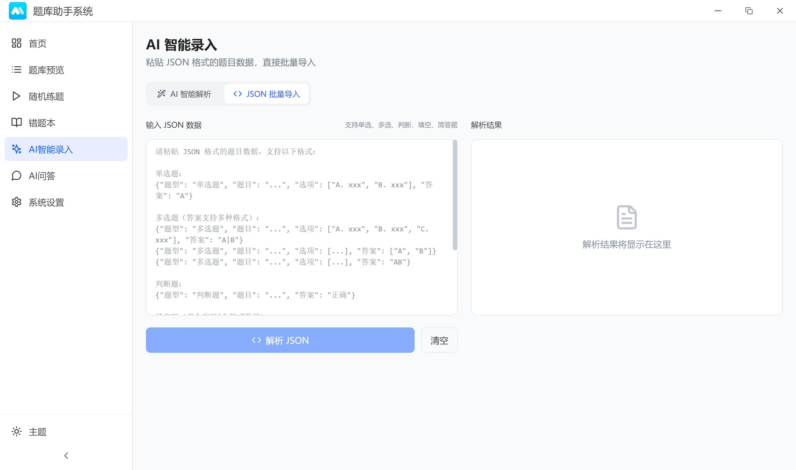
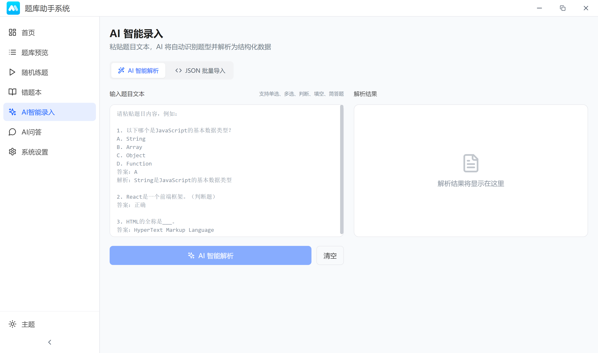

# 题库助手

题库助手是一款基于 Electron + React + Vite 构建的桌面端题库管理与刷题工具，支持 CSV / JSON / AI 导入、随机练题、错题本、统计面板与 AI 问答。


---

## 功能特性

### 题库与题目管理

- **多题库**：创建/编辑/删除题库，按题库管理题目
- **题目管理**：新增、编辑、删除、分页浏览、关键字搜索、按题型筛选
- **题型支持**：单选、多选、判断、填空（题干使用 `__` 标记空位，支持多空）、简答

### 导入与导出

- **CSV 批量导入**：下载标准模板、校验并导入
- **CSV 导出**：按题库导出 CSV（带 UTF-8 BOM，Excel 友好）
- **AI 智能解析导入**：粘贴题目文本，通过你配置的模型解析为结构化数据
- **JSON 批量导入**：支持中文/英文字段，便于从其他系统迁移

### 练习与错题本

- **随机练题**：随机抽题练习，提交后即时判分与解析
- **练习统计**：记录练习历史与正确率趋势
- **错题本**：自动记录练习错题；答对次数达到阈值自动移除；支持随机练错题、按题库筛选、手动移除/清空

### 统计与体验

- **仪表盘**：总题数、今日新增、近 7 日新增、题型分布、操作日志、练习趋势
- **主题**：亮色/暗色/跟随系统
- **桌面体验**：自定义标题栏、单实例运行

---

## 界面预览



---

## 下载安装

### 从 GitHub Releases 下载

前往仓库的 Releases 页面下载对应平台的安装包：

- Windows：`题库助手-<version>-Setup.exe`
- macOS：`题库助手-<version>-<arch>.dmg`
- Linux：`.AppImage`

### 本地构建产物

执行 `npm run electron:build`（或 `npm run electron:build:win` 等）后，安装包会生成在 `release/` 目录下。

## 快速开始

### 环境要求

- Node.js >= 18
- npm >= 9

### 安装依赖

```bash
npm install
```

### 开发（桌面应用）

```bash
npm run electron:dev
```

该命令会同时启动 Vite 开发服务器（默认端口 `5173`）与 Electron 主进程。

### 开发（仅前端预览）

```bash
npm run dev
```

然后访问：

```text
http://localhost:5173
```

### 本地预览（使用 dist）

```bash
npm run electron:preview
```

### 构建与打包

```bash
# 全平台默认（取决于你的当前 OS）
npm run electron:build

# Windows
npm run electron:build:win

# macOS
npm run electron:build:mac

# Linux
npm run electron:build:linux
```

构建完成后，安装包位于 `release/` 目录。

### 清理构建产物

```bash
npm run clean
```

---

## 配置说明

### AI API 配置

在应用内进入：`系统设置` -> `AI API 配置`，完成以下配置：

- **AI 服务提供商**：可选择预设（OpenAI/Claude/Gemini/DeepSeek/通义千问等）或自定义
- **API 地址**：
  - 预设提供商会自动填充（部分提供商可走 OpenAI 兼容接口）
  - 自定义模式可填写任意 OpenAI 兼容的 API Base URL
- **API Key**：你的密钥（仅保存在本地数据库）
- **模型**：如 `gpt-4o-mini` / `claude-3-5-sonnet-20241022` / `gemini-1.5-pro` 等

点击 `测试连接` 可验证配置是否可用。

##### 界面预览：



兼容性说明：

- Claude 与 Gemini 走专用请求格式
- 其他大多数提供商可走 OpenAI 兼容格式（应用会在需要时自动拼接 `/v1/chat/completions`）

### 错题本阈值

在应用内进入：`系统设置` -> `错题本设置`，可设置“答对次数达到阈值后自动移除错题”。

##### 界面预览：



---

## 数据存储与隐私

所有数据默认保存在本地（不会自动上传）。

- **数据库文件**：`question-bank.db`
- **数据库位置**：Electron `app.getPath('userData')` 目录下
  - 启动应用后，主进程控制台会输出数据库路径：`数据库初始化完成，路径: ...`

数据库中包含：题库、题目、设置（含 AI 配置）、草稿、练习记录、错题本、AI Prompt、聊天记录等。

---

## 导入与导出格式

### CSV 导入模板

应用内可下载模板：`批量导入` -> `下载模板`。

表头列为：

```text
题型, 题干, 选项A, 选项B, 选项C, 选项D, 选项E, 选项F, 答案, 解析
```

字段规则（核心）：

- **题型**：`单选题` / `多选题` / `判断题` / `填空题` / `简答题`
- **选择题选项**：至少 2 个选项
- **答案**：
  - 单选题：`A`
  - 多选题：`A|B|D`（使用 `|` 分隔）
  - 判断题：`正确` 或 `错误`
  - 填空题：题干用 `__`（2 个或更多下划线）标记空位；答案用 `|` 分隔，且数量必须与空位数一致
  - 简答题：可填写参考答案

### JSON 批量导入

`AI 智能录入` 页面支持 `JSON 批量导入` 模式，支持单个对象或数组，并支持中英文键名映射。

##### 界面预览：



示例（单选题）：

```json
{
  "题型": "单选题",
  "题目": "以下哪个是 JavaScript 的基本数据类型？",
  "选项": ["A. String", "B. Array", "C. Object", "D. Function"],
  "答案": "A",
  "解析": "字符串是基本数据类型"
}
```

示例（多选题，答案也支持数组/逗号分隔/连续字母等格式，会自动归一化为 `A|B|C`）：

```json
[
  {
    "题型": "多选题",
    "题目": "以下哪些是前端框架？",
    "选项": ["A. React", "B. Vue", "C. Node.js", "D. Angular"],
    "答案": ["A", "B", "D"]
  }
]
```

### AI 智能解析导入

在 `AI 智能录入` 的 `AI 智能解析` 模式中粘贴题目文本，应用会调用你在设置中配置的模型，将内容解析为结构化 JSON（再由你选择导入到某个题库）。

##### 界面预览：



---

## 项目结构

```
question-bank-assistant/
├── image/                    # README 文档图片
│   └── README/               # README 中引用的界面截图
├── electron/                 # Electron 主进程
│   ├── main.cjs              # 主进程入口（窗口创建、IPC、业务编排）
│   ├── preload.cjs           # 预加载脚本（向渲染进程暴露 electronAPI）
│   ├── ai/                   # AI 调用封装
│   ├── csv/                  # CSV 模板/解析/导出
│   ├── database/             # 本地数据库（sql.js）
│   └── validation/           # 数据校验
├── src/                      # React 渲染进程
│   ├── pages/                # 页面（仪表盘/导入/练习/错题本/设置/AI问答等）
│   ├── components/           # 通用组件
│   ├── contexts/             # React Context
│   └── api/                  # 对 window.electronAPI 的封装
├── build/                    # 构建资源（图标等）
├── dist/                     # Vite 构建产物
└── release/                  # electron-builder 打包输出
```

---

## 技术栈

| 类别          | 技术                     |
| ------------- | ------------------------ |
| 桌面框架      | Electron                 |
| 前端框架      | React 18 + React Router  |
| 构建工具      | Vite                     |
| 样式方案      | Tailwind CSS + PostCSS   |
| 本地存储      | sql.js（SQLite in WASM） |
| CSV           | PapaParse                |
| 图表          | Recharts                 |
| 动画          | Framer Motion            |
| Markdown/公式 | react-markdown + KaTeX   |
| 图标          | lucide-react             |

---

## 脚本命令

- **`npm run dev`**：启动 Vite
- **`npm run build`**：构建渲染进程到 `dist/`
- **`npm run preview`**：预览 Vite 构建产物
- **`npm run electron:dev`**：开发模式（Vite + Electron）
- **`npm run electron:preview`**：构建 `dist/` 后启动 Electron 预览
- **`npm run electron:build`**：构建并调用 electron-builder 打包
- **`npm run electron:build:win`**：打 Windows 安装包
- **`npm run electron:build:mac`**：打 macOS 安装包
- **`npm run electron:build:linux`**：打 Linux 安装包
- **`npm run electron:pack`**：仅生成未打包目录（`--dir`）
- **`npm run clean`**：清理 `dist/` 与 `release/`

---

## 发布（GitHub Actions）

仓库已配置按 tag 发布（见 `.github/workflows/release.yml`）：

1. 推送 tag（形如 `v1.0.0`）触发工作流
2. CI 使用 Node.js 20 执行 `npm ci`
3. 运行 `npm run electron:build`
4. 上传 `release/` 下的安装包到 GitHub Releases

---

## 常见问题（FAQ）

### electron:dev 启动失败或白屏

- 确认 `5173` 端口未被占用（Vite 配置固定端口：`vite.config.js`）
- 若你修改了端口，需要同步修改 `electron/main.cjs` 中开发环境加载的 URL

### AI 调用失败

- 确认已在设置中填写正确的 `API Key`、`API 地址` 与 `模型`
- Claude/Gemini 必须使用各自官方 Base URL
- 走 OpenAI 兼容接口的提供商，确保其支持 `/v1/chat/completions`

### CSV 导入乱码

- 优先使用应用下载的模板（写入了 UTF-8 BOM，Excel 更易正确识别编码）

---

## 贡献

欢迎提交 Issue 和 Pull Request。

建议在 PR 中附带：

- **改动说明**：做了什么与为什么
- **截图/录屏**：如果涉及 UI
- **自测步骤**：如何验证改动

---

## 许可证

本仓库根目录当前未提供 `LICENSE` 文件，因此默认不授予任何开源许可。
如果你希望以某种开源协议发布（例如 MIT），请补充 `LICENSE` 并同步更新本 README。
